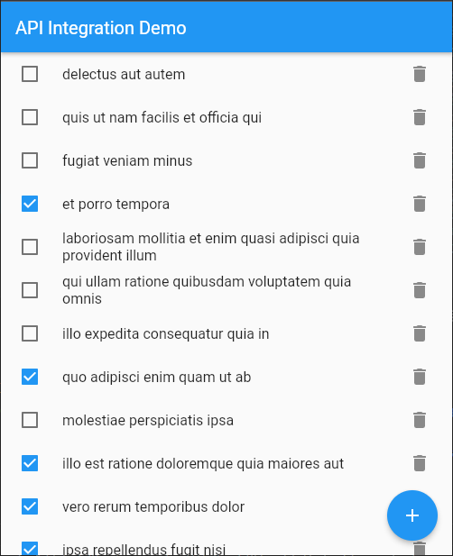

# Flutter API Integration

This Flutter project demonstrates API integration in Flutter using various HTTP methods, including GET, POST, PUT, and DELETE. It interacts with a sample API provided by [Typicode](https://jsonplaceholder.typicode.com/todos) to manage tasks.

## Screenshots

- **Home Screen (Final Output)**  
  

- **API Endpoint from Typicode**  
  

- **Fetching Tasks from API**  
  

- **Creating a New Task**  
  

- **Updating a Task**  
  

- **Deleting a Task**  
  
